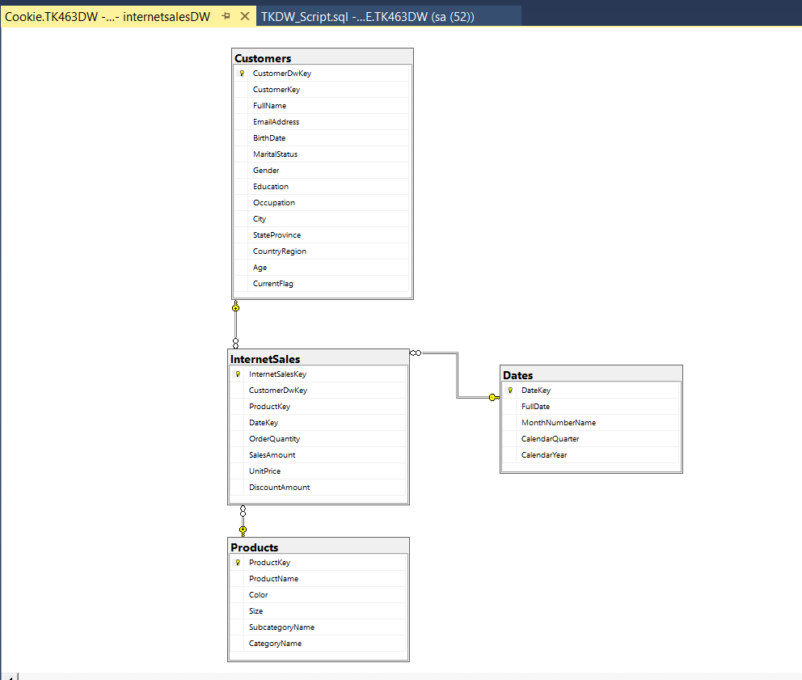

# Creacion de Data Warehouse

___
#### Crear base de datos

```sql
create database tk463DW;
```
##### Nota: se debe de crear una carpeta en el directorio C llamada "C:\TK463"

___
#### modelo de recuperación a Simple -> creación de la base de datos.

```sql
USE master;
IF DB_ID('TK463DW') IS NOT NULL
DROP DATABASE TK463DW;
GO
CREATE DATABASE TK463DW
ON PRIMARY
(NAME = N'TK463DW', FILENAME = N'C:\TK463\TK463DW.mdf',
SIZE = 307200KB , FILEGROWTH = 10240KB )
LOG ON
(NAME = N'TK463DW_log', FILENAME = N'C:\TK463\TK463DW_log.ldf',
SIZE = 51200KB , FILEGROWTH = 10%);
GO
ALTER DATABASE TK463DW SET RECOVERY SIMPLE WITH NO_WAIT;
GO
```
___
#### Objeto de secuencia

```sql
USE TK463DW;
GO
IF OBJECT_ID('dbo.SeqCustomerDwKey','SO') IS NOT NULL
DROP SEQUENCE dbo.SeqCustomerDwKey;
GO
CREATE SEQUENCE dbo.SeqCustomerDwKey AS INT
START WITH 1
INCREMENT BY 1;
GO
```

___
## EJERCICIO 2. Creando Dimensiones
#### crear la dimensión Clientes

```sql
CREATE TABLE dbo.Customers
(
CustomerDwKey INT NOT NULL,
CustomerKey INT NOT NULL,
FullName NVARCHAR(150) NULL,
EmailAddress NVARCHAR(50) NULL,
BirthDate DATE NULL,
MaritalStatus NCHAR(1) NULL,
Gender NCHAR(1) NULL,
Education NVARCHAR(40) NULL,
Occupation NVARCHAR(100) NULL,
City NVARCHAR(30) NULL,
StateProvince NVARCHAR(50) NULL,
CountryRegion NVARCHAR(50) NULL,
Age AS
CASE
WHEN DATEDIFF(yy, BirthDate, CURRENT_TIMESTAMP) <= 40
THEN 'Younger'
WHEN DATEDIFF(yy, BirthDate, CURRENT_TIMESTAMP) > 50
THEN 'Older'
ELSE 'Middle Age'
END,
CurrentFlag BIT NOT NULL DEFAULT 1,
CONSTRAINT PK_Customers PRIMARY KEY (CustomerDwKey)
);
GO
```
___
#### crear la dimensión Fechas y Products

```sql
CREATE TABLE dbo.Dates
(
DateKey INT NOT NULL,
FullDate DATE NOT NULL,
MonthNumberName NVARCHAR(15) NULL,
CalendarQuarter TINYINT NULL,
CalendarYear SMALLINT NULL,
CONSTRAINT PK_Dates PRIMARY KEY (DateKey)
);

GO

CREATE TABLE dbo.Products
(
ProductKey INT NOT NULL IDENTITY(1,1),
ProductName NVARCHAR(150) NULL,
Color NVARCHAR(150) NULL,
Size NVARCHAR(150) NULL,
SubcategoryName NVARCHAR(150) NULL,
CategoryName NVARCHAR(150) NULL,

CONSTRAINT PK_InternetSales_Products
PRIMARY KEY (ProductKey)
);
GO
```

___
## EJERCICIO 3 Crear una tabla de hechos
#### Crear la tabla de hechos InternetSales

```sql
CREATE TABLE dbo.InternetSales
(
InternetSalesKey INT NOT NULL IDENTITY(1,1),
CustomerDwKey INT NOT NULL,
ProductKey INT NOT NULL,
DateKey INT NOT NULL,
OrderQuantity SMALLINT NOT NULL DEFAULT 0,
SalesAmount MONEY NOT NULL DEFAULT 0,
UnitPrice MONEY NOT NULL DEFAULT 0,
DiscountAmount FLOAT NOT NULL DEFAULT 0,

CONSTRAINT PK_InternetSales
PRIMARY KEY (InternetSalesKey)
);
GO
```
___
#### Modifique la tabla de hechos InternetSales para agregar restricciones de clave externa para las relaciones con las tres dimensiones.

```sql
ALTER TABLE dbo.InternetSales ADD CONSTRAINT
FK_InternetSales_Customers FOREIGN KEY(CustomerDwKey)
REFERENCES dbo.Customers (CustomerDwKey);
ALTER TABLE dbo.InternetSales ADD CONSTRAINT
FK_InternetSales_Products FOREIGN KEY(ProductKey)
REFERENCES dbo.Products (ProductKey);
ALTER TABLE dbo.InternetSales ADD CONSTRAINT
FK_InternetSales_Dates FOREIGN KEY(DateKey)
REFERENCES dbo.Dates (DateKey);
GO
```

___
### Crear el diagrama de las bases de datos y guardarlo como "internetsalesDW"
