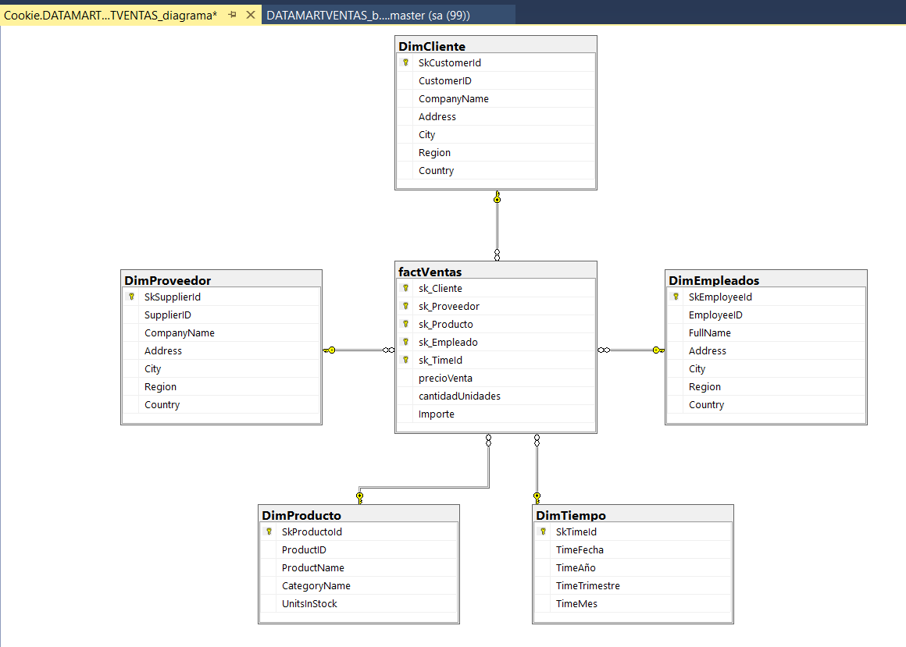

# ETL con data warehouse

#### Creacion del data warehouse (modelo estrella)

___
#### Crear base de datos

```sql
create database DATAMARTVENTAS
USE DATAMARTVENTAS
```
___
#### Se uso vss2022 para poder hacer las tablas destinovy ademas cada ETL se hicieron en paquetes distintos para evitar errores 

___

##### Se agrego un Data Flow Task y configuramos las conexiones de origen (Northwind) y de destino (DATAMARTVENTAS)

##### Entramos al Data Flow
___
##### Agregamos dos ole db source, donde en uno tenemos nuestra conexion a Northwind y el otro es la conexion de nuestra tabla destino (DATAMARTVENTAS)


___
##### Configuraremos el source de esta manera para Northwind 

___
##### Configuraremos el source de esta manera para DATAMARTVENTAS

##### Ordenamos ambas tablas por medio de un sort, ambos sort deben de coincidir en un campo para que puedan ser ordenados.
Este sort es para Northwind

Este sort es para DATAMARTVENTAS

___
##### Agreamos un merge join, siempre espicificando que sera left y agreamos las columnas que ocupamos


___
##### Tomamos un conditional split para agregar una condicion, en caso de ser nulo ese campo le pondra NULL

___
##### Tambien agregamos un column delivered para concatenar el firstName y lastName (por parte de Northwind)


___
##### Por ultimo nuestro ole db Destination donde se encontrara nuestra tabla DimEmpleado

##### y asi haremos con las demas tablas

___
##### Tabla DimProducto


___
##### Tabla DimCliente


___
##### Tabla DimProveedor


___
##### Tabla DimTiempo
para esta tabla se ocupo una consulta directa para poder separar correctamente la fecha
```sql
SELECT 
    o.OrderDate, 
    YEAR(o.OrderDate) AS Anio, 
    DATEPART(quarter, o.OrderDate) AS Trimestre, 
    DATEPART(MONTH, o.OrderDate) AS Mes,
    DATEPART(week, o.OrderDate) AS Semana
FROM 
    Northwind.dbo.Orders o
```
##### esta consulta se pega en el source de Northwind y se siguieron los pasos anteriores.


____
##### Tabla factVentas
Para esta tabla fue necesario hacer merge join a todas las tablas de DATAMARTVENTAS y se unieron con las tablas de Northwind para igualar las tablas y usar las ID correspondientes de Northwind y de DATAMARTVENTAS


_____
##### Data flow final


_____
##### Diagrama del data warehouse
